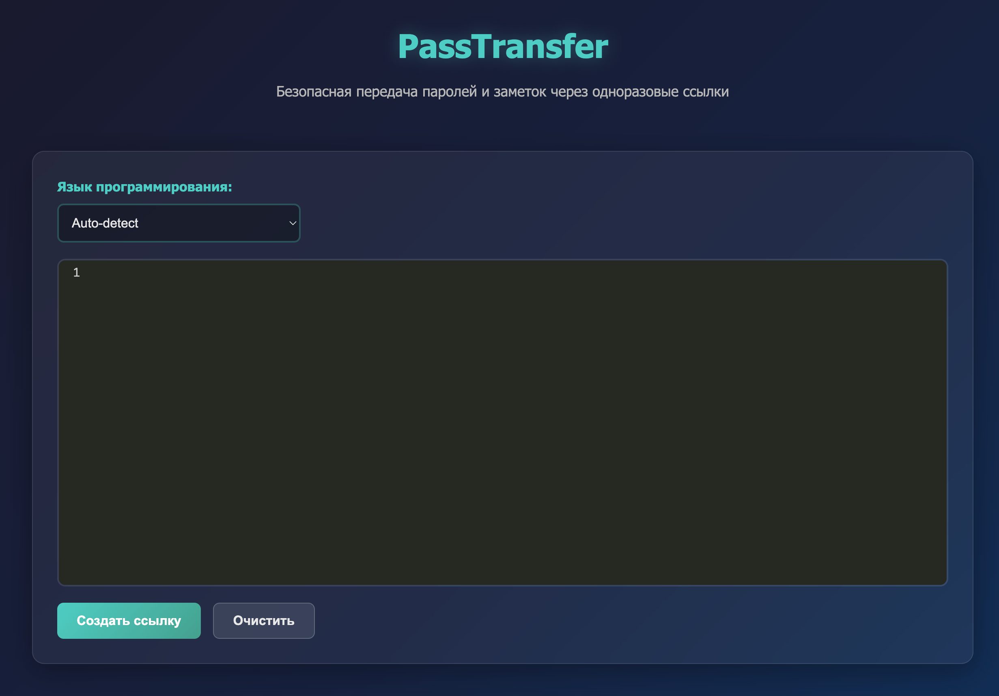
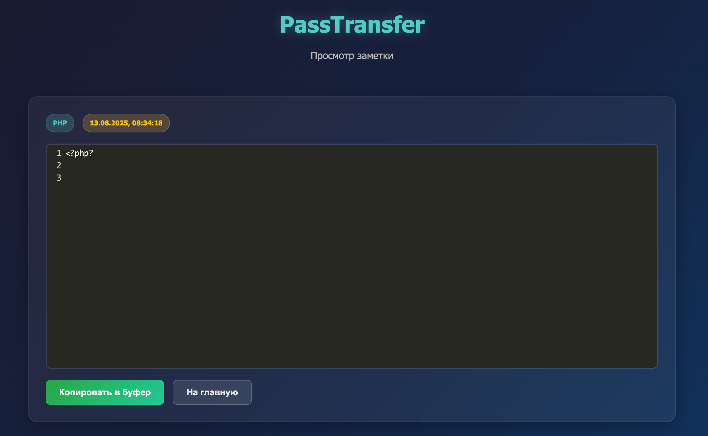
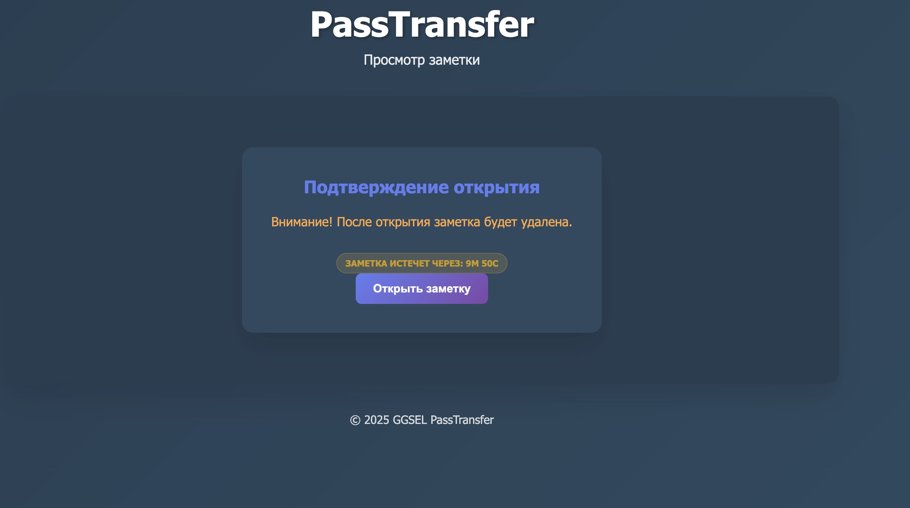
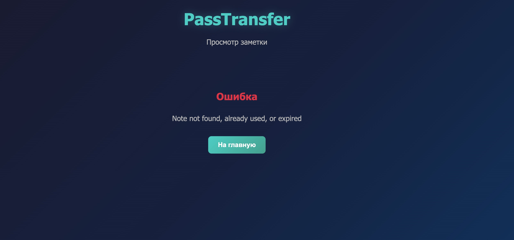

# PassTransfer - Безопасная передача заметок

Приложение для передачи паролей и заметок через одноразовые ссылки с автоматическим удалением после просмотра и настраиваемым временем жизни.



## Возможности

- 🔐 Создание одноразовых ссылок для передачи данных
- ⏰ Настраиваемое время жизни заметок (10 минут, 1 час, 1 день, без ограничений)
- 📝 Поддержка подсветки синтаксиса для 20+ языков программирования
- 🤖 Автоопределение языка по содержимому
- 📱 Адаптивный дизайн для мобильных устройств
- 🌙 Темная тема интерфейса
- 📋 Копирование ссылок и содержимого в буфер обмена
- 📤 Встроенные функции для совместного использования
- 🗄️ Локальное хранение в MySQL
- ⚡ Автоматическое удаление после просмотра
- 🔔 Современная система уведомлений
- 🐛 Условный вывод отладочной информации
- 🚀 Готовность к развертыванию в Kubernetes с Helm

## Поддерживаемые языки

- Plain Text, JavaScript, TypeScript, PHP, Python, Java, C++, C#
- HTML, CSS, SQL, YAML, JSON, XML
- Bash, Ruby, Go, Swift, Dart
- Markdown

## Быстрый старт

Постестировать приложение ничего не устанавливания можно тут

<https://pss.realmanual.ru>

### Docker Compose (рекомендуется)

```bash
# Клонирование репозитория
git clone https://github.com/vasyakrg/pass-transfer.git
cd pass-transfer

# Запуск приложения
docker-compose up -f docker-compose-host.yml -d


# Приложение доступно по адресу: http://localhost - поменяйте на свой домен
```

### Kubernetes с Helm

```bash
# Установка в Kubernetes
helm install my-pass-transfer ./helm

# Установка с кастомными настройками (файл нужно создать)
helm install my-pass-transfer ./helm -f values-prod.yaml

# Обновление
helm upgrade my-pass-transfer ./helm

# Удаление
helm uninstall my-pass-transfer
```

## Структура файлов

```
pass-transfer/
├── config.php              # Конфигурация приложения
├── database.php            # Класс для работы с БД
├── api.php                # API для обработки запросов
├── index.php              # Главная страница создания заметок
├── view.php               # Страница просмотра заметок
├── style.css              # Стили интерфейса
├── common.js              # Общие функции и константы
├── script.js              # JavaScript для главной страницы
├── view.js                # JavaScript для страницы просмотра
├── docker-compose.yml     # Docker Compose конфигурация
├── Dockerfile             # Docker образ
├── .dockerignore          # Исключения для Docker сборки
├── .github/
│   └── workflows/
│       └── docker-publish.yml  # CI/CD для сборки и публикации образов
├── helm/                  # Helm chart для Kubernetes
│   ├── Chart.yaml
│   ├── values.yaml
│   ├── README.md
│   └── templates/
│       ├── deployment.yaml
│       ├── service.yaml
│       ├── ingress.yaml
│       ├── mysql-deployment.yaml
│       ├── mysql-service.yaml
│       ├── mysql-secret.yaml
│       └── _helpers.tpl
├── docker/
│   ├── init.sql           # Инициализация БД
│   ├── migrate.php        # Тестирование БД
│   └── check.sh           # Проверка окружения
├── assets/
│   └── codemirror/        # CodeMirror библиотека
├── img/                   # Скриншоты интерфейса
│   ├── 1.png
│   ├── 2.png
│   └── 3.jpeg
└── README.md              # Документация
```

## Настройка

### Docker Compose

Приложение готово к запуску с Docker Compose:

```bash
# Запуск
docker-compose up -d

# Остановка
docker-compose down

# Пересборка
docker-compose up --build -d

# Просмотр логов
docker-compose logs -f app
```

### Переменные окружения

В `docker-compose.yml` можно настроить:

```yaml
environment:
  - MYSQL_HOST=db
  - MYSQL_DATABASE=pass_transfer
  - MYSQL_USER=passuser
  - MYSQL_PASSWORD=pass123
  - DEBUG=0  # Установите 1 для включения отладки
```

### Helm Chart

Для продакшн развертывания используйте Helm chart:

```yaml
# values-prod.yaml
replicaCount: 3

image:
  repository: ghcr.io/vasyakrg/pass-transfer
  tag: "v1.0.0"

ingress:
  enabled: true
  className: "nginx"
  annotations:
    cert-manager.io/cluster-issuer: "letsencrypt-prod"
  hosts:
    - host: pass-transfer.yourdomain.com
      paths:
        - path: /
          pathType: Prefix

database:
  mysql:
    auth:
      password: "your-secure-password"
    primary:
      persistence:
        size: 2Gi

autoscaling:
  enabled: true
  minReplicas: 2
  maxReplicas: 10
```

## Использование

### Создание заметки



1. Откройте главную страницу
2. Выберите язык программирования или оставьте "Auto-detect"
3. Выберите время жизни заметки (10 минут, 1 час, 1 день, без ограничений)
4. Введите текст или код в редактор
5. Нажмите "Создать ссылку"
6. Скопируйте или поделитесь полученной ссылкой

### Просмотр заметки



1. Получатель переходит по ссылке
2. Система проверяет доступность заметки и время истечения
3. Если заметка истекла - сразу показывается ошибка
4. Если заметка активна - показывается форма подтверждения с таймером
5. При нажатии "Открыть заметку" заметка сразу открывается
6. После просмотра заметка автоматически удаляется


7. При повторном обращении к ссылке показывается ошибка

### Особенности

- **Автоопределение языка**: система автоматически определяет язык по содержимому
- **Одноразовость**: заметки удаляются после первого просмотра
- **Время жизни**: настраиваемое время автоматического истечения
- **Таймер истечения**: отображение оставшегося времени до истечения
- **Уведомления**: современные выплывающие уведомления вместо alert
- **Отладка**: включите `DEBUG=1` для вывода отладочной информации

## Безопасность

- Все заметки автоматически удаляются после первого просмотра
- Настраиваемое время жизни заметок
- Используются подготовленные запросы для защиты от SQL-инъекций
- Чувствительные данные хранятся в Kubernetes Secrets
- Нет авторизации - доступ только по одноразовым ссылкам
- Поддержка HTTPS рекомендуется для продакшена

## Технологии

- **Backend**: PHP 8.2+, MySQL 8.0
- **Frontend**: HTML5, CSS3, JavaScript (ES6+)
- **Редактор**: CodeMirror 5.65.2
- **Контейнеризация**: Docker, Docker Compose
- **Оркестрация**: Kubernetes, Helm
- **CI/CD**: GitHub Actions
- **Стили**: Адаптивный CSS с темной темой
- **Уведомления**: Кастомная система уведомлений

## Разработка

### Команды для разработки

```bash
# Запуск с отладкой
DEBUG=1 docker-compose up -d

# Проверка окружения
./docker/check.sh

# Просмотр логов приложения
docker-compose logs -f app

# Просмотр логов базы данных
docker-compose logs -f db

# Пересборка контейнеров
docker-compose up --build --force-recreate -d

# Остановка и очистка
docker-compose down -v
```

### Структура кода

- `common.js` - общие функции и константы
- `script.js` - логика главной страницы
- `view.js` - логика страницы просмотра с таймером истечения
- `api.php` - REST API для работы с заметками
- `database.php` - класс для работы с MySQL и миграциями

### Отладка

Включите отладку, установив `DEBUG=1` в `docker-compose.yml`:

```yaml
environment:
  - DEBUG=1
```

Это включит вывод отладочной информации в консоль браузера.

## CI/CD

Проект включает автоматическую сборку и публикацию Docker образов:

- Автоматическая сборка при push в любую ветку
- Публикация в GitHub Container Registry (GHCR)
- Автоматическое тегирование (branch, semver, latest)
- Поддержка версионирования через git tags

## Лицензия

MIT License
